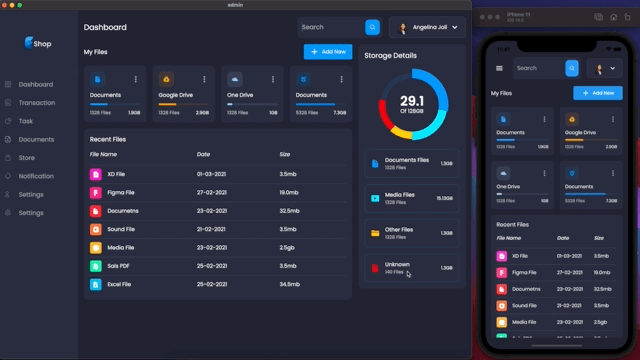

# 📚 Flutter Library App Frontend

[](https://flutter.dev/)
[](https://dart.dev/)
[](LICENSE)
[](https://flutter.dev/docs/development/tools/sdk/release-notes)
[](CONTRIBUTING.md)
[](https://github.com/aliammari1/libraryapp-flutter-front/graphs/contributors)

> A comprehensive, cross-platform digital library management application built with Flutter, featuring modern UI/UX design, secure authentication, and intelligent book management capabilities.



## ✨ Features

### 📖 Core Library Management
- **Digital Book Catalog**: Browse and search through extensive book collections
- **Advanced Search & Filtering**: Find books by title, author, genre, publication year
- **Book Details & Reviews**: Comprehensive book information with user ratings
- **Reading Progress Tracking**: Monitor reading status and progress
- **Personal Bookshelf**: Organize books into custom collections and wishlists

### 🎨 Modern User Interface
- **Material Design 3**: Beautiful, consistent UI following latest design guidelines
- **Custom Theming**: Dark/light mode support with dynamic theming
- **Responsive Design**: Optimized for phones, tablets, and desktop screens
- **Smooth Animations**: Fluid transitions and micro-interactions
- **SVG Graphics**: Scalable vector graphics for crisp visuals

### 📊 Analytics & Insights
- **Reading Statistics**: Track reading habits and progress over time
- **Interactive Charts**: Visual representation of reading data using FL Chart
- **Goal Setting**: Set and monitor reading goals and achievements
- **Reading History**: Comprehensive log of read books and time spent

### 🔐 Security & Authentication
- **Secure Storage**: Encrypted local data storage using Flutter Secure Storage
- **User Authentication**: Secure login and registration system
- **Session Management**: Automatic session handling and token refresh
- **Privacy Protection**: GDPR-compliant data handling

### 📱 Cross-Platform Support
- **iOS Native**: Optimized for iPhone and iPad
- **Android**: Material Design implementation for Android devices
- **Web Application**: Progressive Web App capabilities
- **Desktop**: Windows, macOS, and Linux support
- **Responsive Layout**: Adaptive UI for all screen sizes

### 📷 Advanced Features
- **Camera Integration**: Scan book barcodes for quick addition
- **Image Processing**: Book cover recognition and optimization
- **Provider State Management**: Efficient state management across the app
- **HTTP Client**: Robust API communication with error handling

## 🚀 Quick Start

### Prerequisites

- Flutter SDK 3.5.0 or higher
- Dart SDK 3.5.0 or higher
- Android Studio / VS Code with Flutter extensions
- For iOS development: Xcode 14.0+
- For Android development: Android SDK 33+

### Installation

1. **Clone the repository**
   ```bash
   git clone https://github.com/aliammari1/libraryapp-flutter-front.git
   cd libraryapp-flutter-front
   ```

2. **Install dependencies**
   ```bash
   flutter pub get
   ```

3. **Configure platform-specific settings**

   **For Android:**
   - Update `android/app/build.gradle` with your signing configuration
   - Set minimum SDK version to 21 in `android/app/build.gradle`

   **For iOS:**
   - Open `ios/Runner.xcworkspace` in Xcode
   - Configure your development team and bundle identifier
   - Update deployment target to iOS 12.0+

4. **Run the application**
   ```bash
   # Debug mode
   flutter run

   # Release mode
   flutter run --release

   # Specific platform
   flutter run -d chrome    # Web
   flutter run -d windows   # Windows
   flutter run -d macos     # macOS
   ```

### Environment Setup

Create platform-specific configuration files:

```bash
# Android
touch android/app/src/main/res/values/strings.xml

# iOS
touch ios/Runner/Info.plist
```

## 🏗️ Project Architecture

### Directory Structure

```
lib/
├── main.dart                 # Application entry point
├── app/                      # App-level configuration
│   ├── app.dart             # App widget and themes
│   └── routes.dart          # Route definitions
├── core/                     # Core utilities and constants
│   ├── constants/           # App constants and enums
│   ├── errors/              # Error handling
│   ├── network/             # HTTP client configuration
│   └── utils/               # Utility functions
├── data/                     # Data layer
│   ├── datasources/         # API and local data sources
│   ├── models/              # Data models
│   └── repositories/        # Repository implementations
├── domain/                   # Business logic layer
│   ├── entities/            # Domain entities
│   ├── repositories/        # Repository interfaces
│   └── usecases/            # Business use cases
├── presentation/            # UI layer
│   ├── pages/               # Screen widgets
│   ├── widgets/             # Reusable UI components
│   ├── providers/           # State management
│   └── theme/               # App theming
└── shared/                   # Shared utilities
    ├── extensions/          # Dart extensions
    └── validators/          # Input validators

assets/
├── images/                   # Image assets
├── icons/                    # App icons
└── fonts/                    # Custom fonts
```

### Key Dependencies

```yaml
dependencies:
  flutter: sdk
  cupertino_icons: ^1.0.8      # iOS-style icons
  google_fonts: ^6.2.1         # Custom fonts
  flutter_svg: ^2.0.10         # SVG support
  fl_chart: ^0.69.2            # Charts and graphs
  provider: ^6.1.2             # State management
  path_provider: ^2.1.2        # File system paths
  image: ^4.1.7                # Image processing
  flutter_secure_storage: ^9.0.0  # Secure storage
  http: ^1.1.0                 # HTTP client
  camera: ^0.10.5              # Camera functionality
```

### State Management

The app uses **Provider** pattern for state management:

```dart
// Example provider structure
class LibraryProvider extends ChangeNotifier {
  List<Book> _books = [];
  bool _isLoading = false;
  
  List<Book> get books => _books;
  bool get isLoading => _isLoading;
  
  Future<void> fetchBooks() async {
    _isLoading = true;
    notifyListeners();
    
    try {
      _books = await _bookRepository.getBooks();
    } catch (e) {
      // Handle error
    } finally {
      _isLoading = false;
      notifyListeners();
    }
  }
}
```

## 🎨 UI/UX Design

### Design System

- **Color Palette**: Material Design 3 dynamic theming
- **Typography**: Google Fonts integration with custom font scales
- **Spacing**: 8px grid system for consistent spacing
- **Iconography**: Material Icons with custom SVG icons
- **Animations**: Custom animations with 300ms duration standard

### Screenshots

| Home Screen | Book Details | Search | Profile |
|-------------|--------------|--------|---------|
|  |  |  |  |

### Responsive Breakpoints

```dart
// Responsive design breakpoints
const double mobileBreakpoint = 600;
const double tabletBreakpoint = 900;
const double desktopBreakpoint = 1200;
```

## 🧪 Testing

### Test Structure

```
test/
├── unit/                    # Unit tests
│   ├── models/             # Model tests
│   ├── repositories/       # Repository tests
│   └── usecases/           # Use case tests
├── widget/                 # Widget tests
│   ├── pages/              # Page widget tests
│   └── components/         # Component tests
└── integration/            # Integration tests
    └── app_test.dart       # Full app tests
```

### Running Tests

```bash
# Run all tests
flutter test

# Run specific test file
flutter test test/unit/models/book_test.dart

# Run tests with coverage
flutter test --coverage

# Generate coverage report
genhtml coverage/lcov.info -o coverage/html
```

### Testing Examples

```dart
// Unit test example
testWidgets('Book tile displays correct information', (tester) async {
  final book = Book(
    id: '1',
    title: 'Test Book',
    author: 'Test Author',
  );

  await tester.pumpWidget(
    MaterialApp(
      home: BookTile(book: book),
    ),
  );

  expect(find.text('Test Book'), findsOneWidget);
  expect(find.text('Test Author'), findsOneWidget);
});
```

## 📱 Platform-Specific Features

### iOS Features
- **Cupertino Design**: Native iOS look and feel
- **Haptic Feedback**: Tactile feedback for interactions
- **Face ID/Touch ID**: Biometric authentication support
- **iOS Widgets**: Home screen widget support
- **Siri Shortcuts**: Voice command integration

### Android Features
- **Material You**: Dynamic theming based on wallpaper
- **Adaptive Icons**: Responsive app icons
- **Notification Channels**: Categorized notifications
- **Android Widgets**: Home screen widgets
- **Share Intents**: System-level sharing

### Web Features
- **Progressive Web App**: Installable web application
- **Service Workers**: Offline functionality
- **Web Share API**: Browser-native sharing
- **Responsive Design**: Desktop and mobile layouts

## 🚀 Deployment

### Mobile Deployment

**Android (Google Play Store):**
```bash
# Build release APK
flutter build apk --release

# Build App Bundle
flutter build appbundle --release

# Build for specific architecture
flutter build apk --release --target-platform android-arm64
```

**iOS (App Store):**
```bash
# Build for iOS
flutter build ios --release

# Build IPA
flutter build ipa --release
```

### Web Deployment

```bash
# Build for web
flutter build web --release

# Deploy to Firebase Hosting
firebase deploy --only hosting

# Deploy to GitHub Pages
flutter build web --base-href="/libraryapp-flutter-front/"
```

### Desktop Deployment

```bash
# Windows
flutter build windows --release

# macOS
flutter build macos --release

# Linux
flutter build linux --release
```

## 🔧 Configuration

### Environment Variables

Create `.env` files for different environments:

```env
# .env.development
API_BASE_URL=http://localhost:3000
DEBUG_MODE=true
ENABLE_LOGGING=true

# .env.production
API_BASE_URL=https://api.libraryapp.com
DEBUG_MODE=false
ENABLE_LOGGING=false
```

### Build Configurations

```yaml
# pubspec.yaml build configurations
flutter:
  assets:
    - assets/images/
    - assets/icons/
    - .env.development
    - .env.production
```

## 🤝 Contributing

We welcome contributions! Please see our [Contributing Guidelines](CONTRIBUTING.md) for details.

### Development Workflow

1. **Fork the repository**
2. **Create a feature branch**: `git checkout -b feature/amazing-feature`
3. **Install dependencies**: `flutter pub get`
4. **Make your changes**
5. **Run tests**: `flutter test`
6. **Format code**: `flutter format .`
7. **Analyze code**: `flutter analyze`
8. **Commit changes**: `git commit -m "Add amazing feature"`
9. **Push to branch**: `git push origin feature/amazing-feature`
10. **Open a Pull Request**

### Code Style

- Follow [Dart Style Guide](https://dart.dev/guides/language/effective-dart/style)
- Use `flutter format` for consistent formatting
- Add documentation for public APIs
- Write tests for new features
- Keep functions small and focused

### Pull Request Guidelines

- Fill out the PR template completely
- Include screenshots for UI changes
- Ensure all tests pass
- Update documentation as needed
- Request review from maintainers

## 📈 Performance Monitoring

### Metrics Tracking

```dart
// Performance monitoring
class PerformanceMonitor {
  static void trackScreenLoad(String screenName) {
    // Track screen load times
  }
  
  static void trackUserAction(String action) {
    // Track user interactions
  }
}
```

### Optimization Techniques

- **Lazy Loading**: Load content on demand
- **Image Caching**: Cache images for faster loading
- **State Optimization**: Minimize widget rebuilds
- **Bundle Size**: Optimize app size with tree shaking

## 🌍 Internationalization

### Supported Languages

- English (en)
- Arabic (ar)
- French (fr)
- Spanish (es)

### Adding Translations

```dart
// Add to lib/l10n/app_localizations.dart
class AppLocalizations {
  static const supportedLocales = [
    Locale('en', ''),
    Locale('ar', ''),
    Locale('fr', ''),
    Locale('es', ''),
  ];
}
```

## 🔒 Security

### Security Measures

- **Secure Storage**: Encrypted local data storage
- **API Security**: HTTPS-only communication
- **Input Validation**: Sanitize all user inputs
- **Authentication**: JWT token-based authentication
- **Privacy**: No sensitive data logging

### Security Best Practices

```dart
// Secure storage example
class SecureStorageService {
  static const _storage = FlutterSecureStorage();
  
  static Future<void> storeToken(String token) async {
    await _storage.write(key: 'auth_token', value: token);
  }
  
  static Future<String?> getToken() async {
    return await _storage.read(key: 'auth_token');
  }
}
```

## 📊 Analytics

### Integration

The app integrates with:
- **Firebase Analytics**: User behavior tracking
- **Crashlytics**: Crash reporting
- **Performance Monitoring**: App performance metrics

### Custom Events

```dart
// Track custom events
Analytics.logEvent('book_added', parameters: {
  'book_id': book.id,
  'category': book.category,
});
```

## 🗺️ Roadmap

### Version 2.0 Features
- [ ] AI-powered book recommendations
- [ ] Social features and book clubs
- [ ] Offline reading support
- [ ] Advanced statistics dashboard
- [ ] Multi-library support

### Version 2.1 Features
- [ ] Audio book integration
- [ ] Advanced search with filters
- [ ] Book sharing features
- [ ] Reading goals and challenges
- [ ] Admin dashboard

## 📚 Documentation

### Additional Resources

- [Flutter Documentation](https://docs.flutter.dev/)
- [Dart Language Guide](https://dart.dev/guides)
- [Material Design Guidelines](https://material.io/design)
- [Cupertino Design Guidelines](https://developer.apple.com/design/human-interface-guidelines/)

### API Documentation

Detailed API documentation is available at:
- [API Reference](https://api.libraryapp.com/docs)
- [Postman Collection](https://documenter.getpostman.com/view/collection-id)

## 👥 Authors

### Lead Developer
**Ali Ammari** - *Full Stack Developer & Mobile Expert*
- GitHub: [@aliammari1](https://github.com/aliammari1)
- LinkedIn: [Ali Ammari](https://linkedin.com/in/ali-ammari)
- Email: ali.ammari.dev@gmail.com

### Expertise
- 🎯 **Specialization**: Flutter & Dart development, cross-platform mobile apps
- 🏆 **Experience**: 3+ years in mobile app development
- 🔧 **Skills**: Flutter, Dart, Firebase, REST APIs, State Management
- 📱 **Focus**: Performance optimization, UI/UX design, app architecture

## 🤝 Contributors

Thanks to all contributors who have helped make this project better!

<!-- ALL-CONTRIBUTORS-LIST:START -->
<!-- prettier-ignore-start -->
<!-- markdownlint-disable -->
<table>
  <tr>
    <td align="center"><a href="https://github.com/aliammari1"><br /><sub><b>Ali Ammari</b></sub></a><br /><a href="https://github.com/aliammari1/libraryapp-flutter-front/commits?author=aliammari1" title="Code">💻</a> <a href="#design-aliammari1" title="Design">🎨</a> <a href="https://github.com/aliammari1/libraryapp-flutter-front/commits?author=aliammari1" title="Documentation">📖</a></td>
  </tr>
</table>
<!-- markdownlint-restore -->
<!-- prettier-ignore-end -->
<!-- ALL-CONTRIBUTORS-LIST:END -->

## 📄 License

This project is licensed under the MIT License - see the [LICENSE](LICENSE) file for details.

```
MIT License

Copyright (c) 2024 Ali Ammari

Permission is hereby granted, free of charge, to any person obtaining a copy
of this software and associated documentation files (the "Software"), to deal
in the Software without restriction, including without limitation the rights
to use, copy, modify, merge, publish, distribute, sublicense, and/or sell
copies of the Software, and to permit persons to whom the Software is
furnished to do so, subject to the following conditions:

The above copyright notice and this permission notice shall be included in all
copies or substantial portions of the Software.
```

## 🙏 Acknowledgments

### Libraries & Frameworks
- **Flutter Team** - For the amazing cross-platform framework
- **Google Fonts** - For beautiful typography options
- **FL Chart** - For powerful charting capabilities
- **Flutter Community** - For excellent packages and support

### Design Inspiration
- **Material Design** - Google's design system
- **Cupertino Design** - Apple's design guidelines
- **Dribbble Community** - UI/UX inspiration
- **Behance Designers** - Creative design concepts

### Learning Resources
- **Flutter Documentation** - Comprehensive guides and tutorials
- **Dart Language** - Programming language documentation
- **Stack Overflow** - Community support and solutions
- **GitHub Community** - Open source contributions and examples

### Special Thanks
- **Beta Testers** - For valuable feedback and bug reports
- **Design Community** - For UI/UX feedback and suggestions
- **Open Source Contributors** - For making development possible
- **Flutter Meetup Groups** - For knowledge sharing and networking

## 📞 Support

### Getting Help

- **Documentation**: Check our [Wiki](https://github.com/aliammari1/libraryapp-flutter-front/wiki)
- **Issues**: Report bugs on [GitHub Issues](https://github.com/aliammari1/libraryapp-flutter-front/issues)
- **Discussions**: Join [GitHub Discussions](https://github.com/aliammari1/libraryapp-flutter-front/discussions)
- **Email**: Contact ali.ammari.dev@gmail.com

### Community

- **Discord**: Join our developer community
- **Reddit**: Follow r/FlutterDev for updates
- **Twitter**: Follow [@aliammari1](https://twitter.com/aliammari1)
- **LinkedIn**: Connect on [LinkedIn](https://linkedin.com/in/ali-ammari)

---

<div align="center">
  <p>Made with ❤️ by <a href="https://github.com/aliammari1">Ali Ammari</a></p>
  <p>
    <a href="https://github.com/aliammari1/libraryapp-flutter-front">⭐ Star this repo</a> •
    <a href="https://github.com/aliammari1/libraryapp-flutter-front/issues">🐛 Report Bug</a> •
    <a href="https://github.com/aliammari1/libraryapp-flutter-front/issues">✨ Request Feature</a>
  </p>
</div>