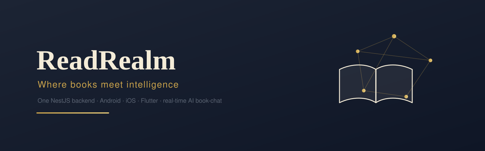
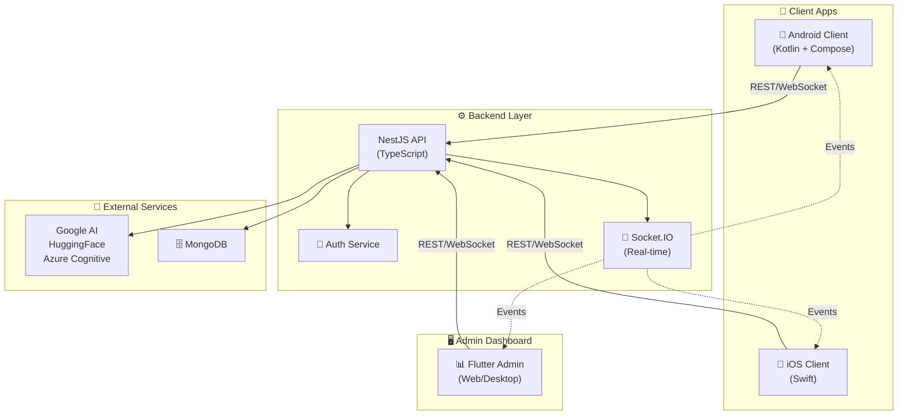

<!-- Banner: placeholder committed at assets/banner.svg. Final art is a TODO — see BANNER.md -->
<p align="center">
  
</p>

# 📚 ReadRealm

### *Where Books Meet Intelligence*

[](https://github.com/aliammari1/readrealm/actions/workflows/ci.yml)
[](https://codecov.io/gh/aliammari1/readrealm)
[](LICENSE)
[](shared/api-spec/openapi.yaml)
[](https://nestjs.com)
[](https://pnpm.io)

An **intelligent, collaborative digital library platform** that combines real-time conversations, AI-powered insights, and seamless cross-platform reading into one unified experience.

> **ReadRealm** transforms how people discover, read, and discuss books. Whether you're on mobile, desktop, or web—your library, conversations, and reading progress sync instantly. Powered by advanced AI and built on cutting-edge cloud infrastructure, ReadRealm empowers readers to go beyond the page.

---

## ✨ Why ReadRealm?

| 🎯 | **Problem** | **ReadRealm Solution** |
|---|---|---|
| 📖 | Scattered reading across devices | Android & iOS client apps + Flutter admin—your library everywhere |
| 🤖 | Passive reading experience | AI-powered insights, smart recommendations, real-time chat |
| 💬 | Reading in isolation | Engage with AI assistants & other readers instantly |
| 🎤 | Text-heavy interfaces | Voice commands & audio narration with Azure Cognitive Services |
| 🔄 | Sync headaches | Automatic cross-platform sync in milliseconds |

---

## 🏗️ Tech Stack & Architecture

### Application Layers

**Frontend (Client Applications):**
- 📱 **Android Client**: Native Kotlin + Jetpack Compose
- 🍎 **iOS Client**: Native Swift
- 🖥️ **Admin Dashboard**: Flutter cross-platform (Web, Desktop, macOS)

**Backend (Single Source of Truth):**
- 🟢 **NestJS API**: TypeScript, RESTful + WebSocket
- 🗄️ **MongoDB**: Scalable data persistence
- 🤖 **AI Services**: Google AI, HuggingFace, Azure Cognitive Services

### Backend Stack
- **Framework**: NestJS 10 with TypeScript
- **Database**: MongoDB with Mongoose ORM
- **Real-time**: Socket.IO for instant chat & collaboration
- **API**: RESTful architecture with OpenAPI specification
- **AI**: Google Generative AI, HuggingFace, Azure Cognitive Services
- **Speech**: Real-time audio processing with FFmpeg

## 🏛️ System Architecture



## 🎬 Demo

ReadRealm is **one backend serving three clients**, so the demo has two halves —
the API/realtime layer (runnable & inspectable) and the native apps (store
artifacts + screenshots).

### Backend & API (the runnable demo)

| What | Where | Status |
|------|-------|--------|
| **Interactive API playground** | [Mintlify docs](docs/docs.json) → *API reference* tab | Driven by the generated [`openapi.yaml`](shared/api-spec/openapi.yaml) |
| **Swagger UI** | `http://localhost:3000/api/docs` | Live when the API runs |
| **Self-host in one command** | `docker compose up` (API + MongoDB) | r/selfhosted-friendly |
| **Edge / realtime** | [`apps/api/cloudflare`](apps/api/cloudflare/README.md) | DO realtime **implemented**; Workers HTTP bridge = good-first-issue |

```bash
# Run the whole backend locally (API + MongoDB) and open the docs:
docker compose up
# → REST API at http://localhost:3000, Swagger UI at /api/docs
```

> **Honest status:** the realtime **Durable Object** (`chat-room.do.ts`) is a full
> implementation using the WebSocket Hibernation API. The **NestJS → Cloudflare
> Workers** HTTP bridge is intentionally left as a clearly-scoped
> [good-first-issue](apps/api/cloudflare/README.md#needs-port-remaining-work-before-a-deploy)
> rather than shipping a half-working port — the NestJS app itself runs today on
> Node, and nothing is deployed to Cloudflare.

### Native clients (screenshots / build artifacts)

The Android and iOS reader apps ship as **APK / TestFlight builds + screenshots**
(see each client's README). The Flutter admin dashboard runs on web/desktop —
preview at [`apps/dashboard/ui.png`](apps/dashboard/ui.png).

| Client | Try it | README |
|--------|--------|--------|
| Android | Build an APK: `cd apps/android && ./gradlew assembleDebug` | [apps/android](apps/android/README.md) |
| iOS | Open in Xcode (scheme **ReadRealm**) → simulator | [apps/ios](apps/ios/README.md) |
| Flutter admin | `cd apps/dashboard && flutter run -d chrome` | [apps/dashboard](apps/dashboard/README.md) |

## 🚀 Core Features

### 📚 **Intelligent Library Management**
Organize thousands of books with AI-powered categorization, smart search, and personalized recommendations based on reading habits and preferences.

### 💬 **Real-time Collaborative Chat**
Discuss books with AI assistants and other readers instantly. Socket.IO powers millisecond-latency conversations with automatic sync across all your devices.

### 🎤 **Advanced Voice Integration**
- Speech-to-text for hands-free interaction
- AI-powered text-to-speech using Azure Cognitive Services
- Perfect for commuters, visually impaired users, and multitaskers

### 🔄 **True Cross-Platform Sync**
Read a book on Android in the morning, continue on your iPad at lunch, finish on desktop at night—your progress, bookmarks, and notes follow you everywhere.

### 🤖 **AI-Powered Intelligence**
- **Content Generation**: Auto-generated summaries and analysis
- **Smart Recommendations**: Books tailored to your taste
- **Study Aids**: Key points extraction, Q&A generation
- **Multi-provider AI**: Google, HuggingFace, and Azure working together

### 📖 **Full EPUB Support**
Professional e-book rendering with rich formatting, embedded fonts, images, and styling. No compromises on reading experience.

### 🔐 **Enterprise-Grade Security**
- JWT-based authentication
- Email verification & 2FA ready
- Secure password hashing
- API key management for AI services

## ⚡ Quick Start

### Prerequisites

Your development environment needs (select based on what you're developing):

**For Backend (API):**
```
✅ Node.js 20+           
✅ MongoDB 5+            (local or cloud instance)
```

**For Android Client:**
```
✅ Android SDK 24+       
✅ Gradle 8+             
✅ Kotlin 1.9+           
```

**For iOS Client:**
```
✅ Xcode 15+             (macOS only)
✅ CocoaPods             (dependency manager)
```

**For Admin Dashboard (Flutter):**
```
✅ Flutter SDK 3.20+     
✅ Dart SDK 3.4+         
```

**Optional:**
```
✅ Docker               (containerized deployment)
✅ Git                  (version control)
```

### Environment Setup

Before running the backend, configure environment variables:

```bash
# 1. Copy template to actual config
cp apps/api/.env.example apps/api/.env

# 2. Edit with your API keys
# Required variables:
#   - MONGODB_URL: MongoDB connection string
#   - JWT_SECRET: Authentication secret (min 32 chars)
#   - GOOGLE_AI_KEY: Google Generative AI key
#   - HUGGINGFACE_API_KEY: HuggingFace API key
#   - AZURE_*: Azure Cognitive Services keys
#   - MAIL_*: Email service configuration

nano apps/api/.env  # or open in your editor
```

**Configuration Reference:**
- **Shared Reference**: [shared/config/.env.example](shared/config/.env.example) — All available variables
- **Backend Template**: [apps/api/.env.example](apps/api/.env.example) — Backend-specific setup
- **Docker Setup**: Use environment variables when running `docker-compose up`

### Installation

```bash
# 1. Clone repository
git clone https://github.com/aliammari1/readrealm.git
cd readrealm

# 2. Install backend dependencies (pnpm)
cd apps/api && pnpm install && cd ../..

# 3. Install admin dashboard dependencies
cd apps/dashboard && flutter pub get && cd ../..

# 4. Configure backend environment (see Environment Setup above)
cp apps/api/.env.example apps/api/.env
# Edit apps/api/.env with your API keys
```

### Run Applications

| Layer | App | Command | Purpose |
|-------|-----|---------|---------|
| **Backend** 🟢 | API | `cd apps/api && pnpm run start:dev` | Core server on `http://localhost:3000` |
| **Clients** 📱 | Android | `cd apps/android && ./gradlew installDebug` | Native Android reader app |
| **Clients** 📱 | iOS | Open `apps/ios/ReadRealm/Application.xcodeproj` (scheme **ReadRealm**) | Native iOS reader app |
| **Admin** 🖥️ | Flutter Dashboard | `cd apps/dashboard && flutter run -d chrome` | Admin dashboard (Web/Desktop) |

For Taskfile users (recommended):
```bash
task setup                # First-time setup (install all deps)
task api:dev             # Backend: Start API development server
task android:build       # Client: Build Android APK
task ios:build           # Client: Build iOS app
task dashboard:run       # Admin: Start Flutter dashboard
task test                # Backend: Run all tests
```

## 📂 Project Structure

```
readrealm/
├── apps/                          # Multi-tier Application Suite
│   │
│   ├── api/                       # 🌍 BACKEND - Core API Server
│   │   └── Behind all client apps, serving Android, iOS, and Admin Dashboard
│   │   ├── src/
│   │   │   ├── auth/             # JWT authentication & guards
│   │   │   ├── book/             # Book management, EPUB processing
│   │   │   ├── chat/             # Socket.IO real-time chat
│   │   │   ├── user/             # User profiles & management
│   │   │   ├── verification/     # Email verification workflows
│   │   │   ├── speech-realtime/  # Voice integration
│   │   │   ├── guards/           # Auth guards & middleware
│   │   │   ├── logger/           # Structured logging
│   │   │   └── main.ts           # App entry point
│   │   ├── test/                 # E2E tests (Jest)
│   │   └── package.json
│   │
│   ├── android/                   # 📱 CLIENT APP - Native Android
│   │   └── End-user reading application
│   │   ├── app/
│   │   │   └── src/
│   │   │       ├── androidTest/  # UI tests
│   │   │       ├── main/
│   │   │       │   ├── kotlin/   # Kotlin + Compose source
│   │   │       │   └── res/      # Android resources
│   │   │       └── test/         # Unit tests
│   │   ├── build.gradle.kts
│   │   ├── proguard-rules.pro    # Code obfuscation
│   │   └── gradle/
│   │
│   ├── ios/                       # 🍎 CLIENT APP - Native iOS
│   │   └── End-user reading application
│   │   ├── Runner/               # Main app target
│   │   │   └── Swift source files
│   │   └── RunnerTests/          # Unit tests
│   │
│   └── dashboard/                 # 🖥️ ADMIN DASHBOARD - Flutter
│       └── Cross-platform admin interface (Web, Desktop, macOS)
│       ├── lib/
│       │   ├── main.dart
│       │   ├── screens/          # Admin UI screens
│       │   ├── services/         # API integrations
│       │   ├── providers/        # State management
│       │   ├── models/           # Data models
│       │   ├── controllers/      # Business logic
│       │   └── constants.dart
│       ├── android/              # Android build config
│       ├── ios/                  # iOS build config
│       ├── web/                  # Web build config
│       ├── windows/              # Windows build config
│       ├── macos/                # macOS build config
│       └── pubspec.yaml
│
├── shared/                        # 📦 Shared Resources
│   ├── api-spec/
│   │   └── openapi.yaml          # REST API specification (all apps use this)
│   ├── config/                   # Shared configuration
│   └── docs/                     # System documentation
│
├── scripts/                       # 🛠️ Automation Scripts
├── docker-compose.yaml            # Docker Compose configuration
├── Taskfile.yml                   # Task automation
├── README.md                      # This file
└── .gitignore
```

### Application Roles

| App | Type | Purpose | Tech | Users |
|-----|------|---------|------|-------|
| **API** | Backend | Serves all clients, manages data & AI | NestJS, MongoDB | All clients |
| **Android** | Client | Native mobile reading app | Kotlin + Jetpack Compose | End users |
| **iOS** | Client | Native mobile reading app | Swift | End users |
| **Dashboard** | Admin | Management, analytics, moderation | Flutter | Administrators |

### Backend Module Responsibilities

| Module | Purpose | Tech |
|--------|---------|------|
| `auth` | User authentication & authorization | JWT, bcrypt |
| `book` | Book library & EPUB parsing | Mongoose, pdf-lib |
| `chat` | Real-time conversations | Socket.IO, NestJS Gateways |
| `user` | Profile management & preferences | MongoDB, Mongoose |
| `verification` | Email verification & OTP | NodeMailer, Crypto |
| `speech-realtime` | Voice processing | FFmpeg, Azure Cognitive |

---

## 📚 Documentation

| Document | Purpose |
|----------|---------|
| [Quick Start Guide](QUICKSTART.md) | 30-second setup to get running |
| Swagger UI | Interactive API explorer at `/api/docs` when the API is running |
| [Mintlify docs](docs/docs.json) | Hosted docs + OpenAPI playground (driven by the generated spec) |
| [API spec](shared/api-spec/openapi.yaml) | Generated OpenAPI 3 specification |
| [API README](apps/api/README.md) | Backend architecture, scripts, AI providers, Cloudflare |
| [Configuration Reference](shared/config/.env.example) | All environment variables explained |
| [Security policy](shared/docs/security.md) | How to report vulnerabilities |
| [Cloudflare design](apps/api/cloudflare/README.md) | Workers + Durable Object edge plan |
| [Contributing Guide](CONTRIBUTING.md) | Code contribution guidelines & architecture |
| [Code of Conduct](CODE_OF_CONDUCT.md) | Community standards |

---

## 🤝 Contributing

We love contributions! To get started:

1. **Fork** the repository
2. **Create** a feature branch: `git checkout -b feature/amazing-feature`
3. **Commit** your changes: `git commit -m 'Add amazing feature'`
4. **Push** to the branch: `git push origin feature/amazing-feature`
5. **Submit** a Pull Request

### Development Guidelines

- Follow the [Code Style Guide](CONTRIBUTING.md)
- Write tests for new features
- Update documentation as needed
- Run linting & tests before submitting PR: `task test && task lint`

---

## 🧭 Engineering decisions

A short, honest account of the non-obvious choices — recruiters reward
demonstrated judgment, not just code volume.

- **MIT license, monetize hosting.** The code is open (MIT); the offering is
  running it for you. This unblocks self-hosted discovery and contributions.
- **pnpm, not Bun.** `apps/api` standardizes on pnpm with a committed
  `pnpm-lock.yaml` and `packageManager` pinned — reproducible installs in CI.
- **OpenAPI is generated, not hand-written.** `shared/api-spec/openapi.yaml`
  comes from the live NestJS app via `@nestjs/swagger`
  (`pnpm --filter @readrealm/api generate:openapi`); CI fails on drift, and the
  same spec powers Swagger UI (`/api/docs`) and the Mintlify docs.
- **AI is multi-provider, unified behind config.** Google / OpenAI / HuggingFace
  / Azure already power summaries, TTS and speech; the new **AI book-chat
  participant** adds Anthropic (streaming Claude `claude-haiku-4-5` + tool use)
  as the in-chat companion — additive, not a rewrite.
- **Cloudflare: right primitive per workload.** The HTTP API targets **Workers**
  (`nodejs_compat`) to lift the existing NestJS app without a rewrite; the
  realtime chat targets a **Durable Object** because Socket.IO has no edge
  runtime. Data stays on **MongoDB Atlas** to keep the Mongoose models (D1 would
  mean a SQL rewrite). Config + scaffold live in
  [`apps/api/cloudflare`](apps/api/cloudflare) — nothing is deployed.
- **`rt-client` is a raw-tarball dependency.** The Azure realtime-audio SDK is
  pulled from a GitHub-release `.tgz`, not a registry — a supply-chain surface
  that Renovate/Trivy can't pin. It's flagged in CI and disabled in Renovate;
  revisit when Azure publishes to npm.

### Client strategy (flagged redundancy)

ReadRealm ships **three** clients — Android (Kotlin/Compose), iOS (SwiftUI) and a
Flutter dashboard — all against the same API. That's a lot of overlapping
surface to maintain. Recommendation: treat **Flutter as the primary client**
(one codebase → Android, iOS, web, desktop) and keep the native Kotlin/Swift
apps as **reference implementations** of platform-idiomatic patterns rather than
shipping all three in parallel.

> Cleanup still open as good-first-issues: rename the iOS Xcode **target** off
> `Application` (the dir/scheme/bundle-id are already rebranded — see
> `apps/ios/README.md`), and the Android `tn.esprit.libraryapp` package id (an
> 80+ file refactor) → a `readrealm` package.

## 📄 License

ReadRealm is open-source software licensed under the **MIT** license
(`SPDX-License-Identifier: MIT`). The code is open; commercial hosting of the
platform remains the maintainer's offering. See [LICENSE](LICENSE) for details.

---

## 💬 Get Involved

- 🐛 **Found a bug?** [Open an issue](https://github.com/aliammari1/readrealm/issues)
- 💡 **Have an idea?** [Start a discussion](https://github.com/aliammari1/readrealm/discussions)
- 📧 **Questions?** Reach out to the team

---

**Made with ❤️ by the ReadRealm team**
