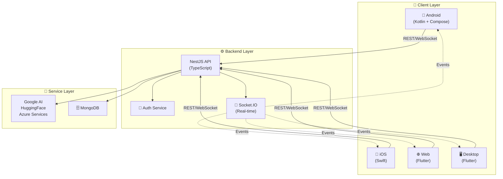

# 📚 ReadRealm

### *Where Books Meet Intelligence*

An **intelligent, collaborative digital library platform** that combines real-time conversations, AI-powered insights, and seamless cross-platform reading into one unified experience.

> **ReadRealm** transforms how people discover, read, and discuss books. Whether you're on mobile, desktop, or web—your library, conversations, and reading progress sync instantly. Powered by advanced AI and built on cutting-edge cloud infrastructure, ReadRealm empowers readers to go beyond the page.

---

## ✨ Why ReadRealm?

| 🎯 | **Problem** | **ReadRealm Solution** |
|---|---|---|
| 📖 | Scattered reading across devices | Native apps + Flutter dashboard—your library everywhere |
| 🤖 | Passive reading experience | AI-powered insights, smart recommendations, real-time chat |
| 💬 | Reading in isolation | Engage with AI assistants & other readers instantly |
| 🎤 | Text-heavy interfaces | Voice commands & audio narration with Azure Cognitive Services |
| 🔄 | Sync headaches | Automatic cross-platform sync in milliseconds |

---

## 🏗️ Tech Stack

### Backend Architecture
```
NestJS 10 + TypeScript  →  RESTful API + Socket.IO  →  Real-time Collaboration
    ↓
MongoDB (Mongoose)  →  Scalable Data Layer
    ↓
Google AI + HuggingFace + Azure Cognitive Services  →  AI Intelligence
```

**Backend Stack:**
- 🟢 **Framework**: NestJS 10 with TypeScript
- 🗄️ **Database**: MongoDB with Mongoose ORM
- 🔌 **Real-time**: Socket.IO for instant chat & collaboration
- 📡 **API**: RESTful architecture with OpenAPI specification
- 🤖 **AI**: Google Generative AI, HuggingFace, Azure Cognitive Services
- 🎤 **Speech**: Real-time audio with FFmpeg integration

### Frontend Stack
- 📱 **Android**: Native Kotlin + Jetpack Compose
- 🍎 **iOS**: Native Swift
- 🖥️ **Cross-Platform**: Flutter (Web, Windows, macOS, Android, iOS)
- 📊 **State Management**: Provider pattern (Flutter)

## 🏛️ System Architecture



## 🚀 Core Features

### 📚 **Intelligent Library Management**
Organize thousands of books with AI-powered categorization, smart search, and personalized recommendations based on reading habits and preferences.

### 💬 **Real-time Collaborative Chat**
Discuss books with AI assistants and other readers instantly. Socket.IO powers millisecond-latency conversations with automatic sync across all your devices.

### 🎤 **Advanced Voice Integration**
- Speech-to-text for hands-free interaction
- AI-powered text-to-speech using Azure Cognitive Services
- Perfect for commuters, visually impaired users, and multitaskers

### 🔄 **True Cross-Platform Sync**
Read a book on Android in the morning, continue on your iPad at lunch, finish on desktop at night—your progress, bookmarks, and notes follow you everywhere.

### 🤖 **AI-Powered Intelligence**
- **Content Generation**: Auto-generated summaries and analysis
- **Smart Recommendations**: Books tailored to your taste
- **Study Aids**: Key points extraction, Q&A generation
- **Multi-provider AI**: Google, HuggingFace, and Azure working together

### 📖 **Full EPUB Support**
Professional e-book rendering with rich formatting, embedded fonts, images, and styling. No compromises on reading experience.

### 🔐 **Enterprise-Grade Security**
- JWT-based authentication
- Email verification & 2FA ready
- Secure password hashing
- API key management for AI services

## ⚡ Quick Start

### Prerequisites

Your development environment needs:

```
✅ Node.js 20+           (Backend & tooling)
✅ Flutter SDK          (Dashboard & cross-platform)
✅ Android SDK 24+      (Native Android development)
✅ Xcode 15+            (iOS development)
✅ Docker               (Optional - containerized deployment)
✅ Git                  (Version control)
```

### Environment Setup

Create `.env` file in `apps/api/`:
```bash
GOOGLE_AI_KEY=your_key
HUGGINGFACE_API_KEY=your_key
AZURE_SPEECH_KEY=your_key
MONGODB_URL=mongodb://localhost:27017/readrealm
JWT_SECRET=your_secret
```

### Installation

```bash
# 1. Clone repository
git clone https://github.com/aliammari1/readrealm.git
cd readrealm

# 2. Install all dependencies
npm ci
cd apps/api && npm ci && cd ../..
cd apps/dashboard && flutter pub get && cd ../..

# 3. Start development servers
task api:dev          # Backend on http://localhost:3000
task dashboard:run    # Flutter dashboard
```

### Run on Specific Platforms

| Platform | Command |
|----------|---------|
| **API** | `cd apps/api && npm run start:dev` |
| **Flutter Web** | `cd apps/dashboard && flutter run -d chrome` |
| **Android Emulator** | `cd apps/dashboard && flutter run` |
| **iOS** | `cd apps/dashboard && flutter run -d ios` |
| **Docker** | `docker-compose up` |

For Taskfile users (recommended):
```bash
task setup              # First-time setup
task api:dev           # API development
task dashboard:run     # Flutter dashboard
task android:build     # Build Android APK
task test              # Run all tests
```

## 📂 Project Structure

```
readrealm/
├── apps/                          # Multi-platform applications
│   ├── api/                       # 🟢 NestJS Backend
│   │   ├── src/
│   │   │   ├── auth/             # JWT authentication & guards
│   │   │   ├── book/             # Book management, EPUB processing
│   │   │   ├── chat/             # Socket.IO real-time chat
│   │   │   ├── user/             # User profiles & management
│   │   │   ├── verification/     # Email verification workflows
│   │   │   ├── speech-realtime/  # Voice integration
│   │   │   ├── guards/           # Auth guards & middleware
│   │   │   ├── logger/           # Structured logging
│   │   │   └── main.ts           # App entry point
│   │   ├── test/                 # E2E tests (Jest)
│   │   └── package.json
│   │
│   ├── dashboard/                 # 🌍 Flutter Cross-Platform
│   │   ├── lib/
│   │   │   ├── main.dart
│   │   │   ├── screens/          # UI screens
│   │   │   ├── services/         # API & service layer
│   │   │   ├── providers/        # State management
│   │   │   ├── models/           # Data models
│   │   │   └── constants.dart
│   │   ├── android/              # Android native code
│   │   ├── ios/                  # iOS native code
│   │   ├── web/                  # Web build config
│   │   ├── windows/              # Windows build config
│   │   ├── macos/                # macOS build config
│   │   └── pubspec.yaml
│   │
│   ├── android/                   # 📱 Native Android (Kotlin)
│   │   ├── app/
│   │   ├── build.gradle.kts
│   │   └── gradle/
│   │
│   └── ios/                       # 🍎 Native iOS (Swift)
│       ├── Runner/
│       └── RunnerTests/
│
├── shared/                        # 📦 Shared Resources
│   ├── api-spec/
│   │   └── openapi.yaml          # REST API specification
│   ├── config/                   # Shared configuration
│   └── docs/                     # System documentation
│
├── scripts/                       # 🛠️ Automation Scripts
├── docker-compose.yaml            # Docker Compose configuration
├── Taskfile.yml                   # Task automation
├── README.md                      # This file
└── .gitignore
```

### Module Responsibilities

| Module | Purpose | Tech |
|--------|---------|------|
| `auth` | User authentication & authorization | JWT, bcrypt |
| `book` | Book library & EPUB parsing | Mongoose, pdf-lib |
| `chat` | Real-time conversations | Socket.IO, NestJS Gateways |
| `user` | Profile management & preferences | MongoDB, Mongoose |
| `verification` | Email verification & OTP | NodeMailer, Crypto |
| `speech-realtime` | Voice processing | FFmpeg, Azure Cognitive |

---

## 📚 Documentation

| Document | Purpose |
|----------|---------|
| [API Docs](shared/api-spec/openapi.yaml) | REST API specification (OpenAPI/Swagger) |
| [System Design](shared/docs/system-design.md) | Architecture, patterns, and design decisions |
| [Setup Guide](shared/docs/setup.md) | Detailed environment configuration |
| [Contributing](CONTRIBUTING.md) | Code contribution guidelines |

---

## 🤝 Contributing

We love contributions! To get started:

1. **Fork** the repository
2. **Create** a feature branch: `git checkout -b feature/amazing-feature`
3. **Commit** your changes: `git commit -m 'Add amazing feature'`
4. **Push** to the branch: `git push origin feature/amazing-feature`
5. **Submit** a Pull Request

### Development Guidelines

- Follow the [Code Style Guide](CONTRIBUTING.md)
- Write tests for new features
- Update documentation as needed
- Run linting & tests before submitting PR: `task test && task lint`

---

## 📄 License

ReadRealm is open-source software licensed under the **UNLICENSED** license. See [LICENSE](LICENSE) for details.

---

## 💬 Get Involved

- 🐛 **Found a bug?** [Open an issue](https://github.com/aliammari1/readrealm/issues)
- 💡 **Have an idea?** [Start a discussion](https://github.com/aliammari1/readrealm/discussions)
- 📧 **Questions?** Reach out to the team

---

**Made with ❤️ by the ReadRealm team**
