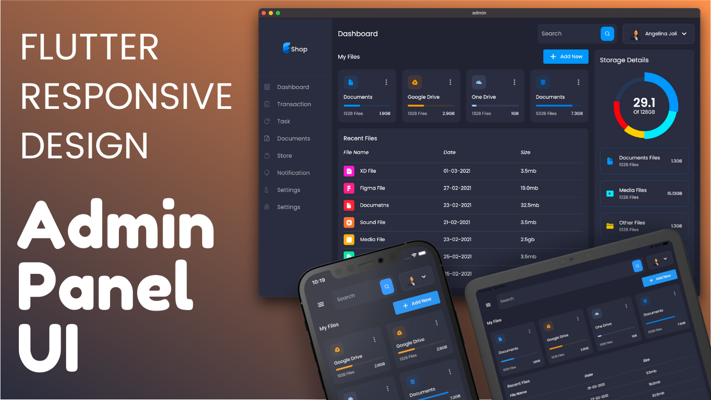

# ReadRealm — Admin Dashboard (Flutter)

[](https://flutter.dev/)
[](https://dart.dev/)
[](https://docs.flutter.dev/platform-integration)
[](../../LICENSE)

The **admin dashboard** for [ReadRealm](../../README.md) — a Flutter app for
administrators (management, analytics, moderation), talking to the same shared
NestJS API as the Android and iOS reader clients.

> This is one of three clients sharing a single backend. The native Android/iOS
> apps are the end-user readers; this Flutter app is the admin surface. See the
> root README for the architecture and the
> [client strategy](../../README.md#client-strategy-flagged-redundancy) note on
> consolidating the clients onto Flutter.



## What's actually here

A Provider-based Flutter app. The real layout under `lib/`:

```
lib/
├── main.dart                 # entry point
├── constants.dart            # colors, spacing, defaults
├── responsive.dart           # desktop / tablet / mobile breakpoints
├── controllers/              # menu_app_controller (layout state)
├── providers/                # auth, user, search (ChangeNotifier state)
├── models/                   # auth_state, user, book, review, recent/my files
└── screens/
    ├── main/                 # shell + side menu
    ├── dashboard/            # overview, charts, user table, storage cards
    ├── user_reviews/         # review moderation
    ├── bookmarked_books/     # bookmarked-books view
    ├── face_recognition/     # face-recognition login screen
    ├── login_screen.dart
    └── register_screen.dart
```

State is managed with **Provider** (`auth_provider`, `user_provider`,
`search_provider`); API access goes over HTTP to the ReadRealm backend.

## Getting started

### Prerequisites

- **Flutter SDK 3.5+** / **Dart 3.5+** (`flutter doctor` should be clean)
- A Chrome browser (for web) or a desktop toolchain (for macOS/Windows/Linux)

### Run

```bash
cd apps/dashboard
flutter pub get
flutter run -d chrome        # web
# or: flutter run -d macos / -d windows / -d linux
```

The dashboard expects the API at `http://localhost:3000` by default (see
`lib/constants.dart`). Run the [API](../api) first.

### Build

```bash
flutter build web            # -> build/web
flutter build macos          # / windows / linux
```

## Testing & analysis

```bash
flutter test                 # widget tests (test/)
flutter analyze              # very_good_analysis (run in CI)
```

CI runs `flutter analyze` + `flutter test` on every push (see the root
`.github/workflows/ci.yml`).

## License

MIT — see the [root LICENSE](../../LICENSE).
